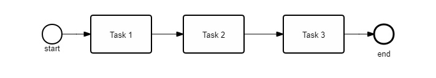
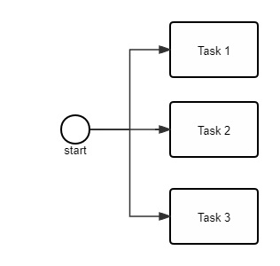
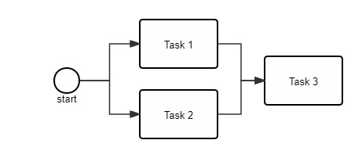
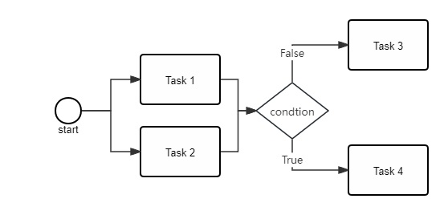
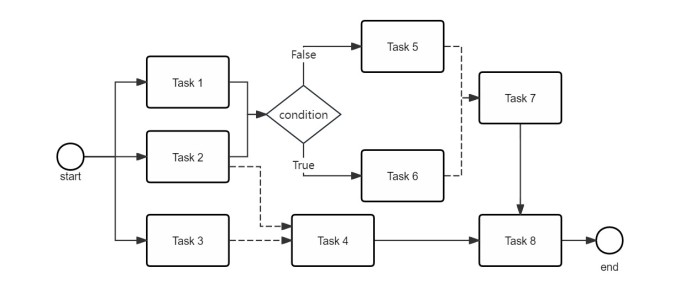

<div align="center">
<h1 align="center">Chyohn Terse Project</h1>


简体中文 | [English](doc/en/readme_en.md)  

</div>

## 介绍

Chyohn Terse是一个高性能轻量级流程并发设计框架，具有无锁线程安全的特点。

## 功能特性 🎯

1. 无锁设计，线程安全
2. 协程特性，流程中所有任务的提交和任务结果回调处理都在主线程中执行，只有任务逻辑在默认线程池或指定的线程池中异步执行。
3. 流程自动编排、任务异步、任务复用、条件判断分支选择
4. 支持任务之间强依赖和弱依赖关系
5. 支持面向任务和面向流程两种设计方式，纯代码设计，无流程配置文件
6. 支持批任务处理
7. 可分布式执行任务，无需修改代码即可具有分布式能力。

## 开发语言
JDK8+

## maven引入

### 1. 一般项目
```xml
<dependency>
    <groupId>io.github.chyohn.terse</groupId>
    <artifactId>terse</artifactId>
    <version>${terse.version}</version>
</dependency>
```

### 2. spring项目
```xml
<dependency>
    <groupId>io.github.chyohn.terse</groupId>
    <artifactId>terse-spring</artifactId>
    <version>${terse.version}</version>
</dependency>
```

### 3. spring boot项目
```xml
<dependency>
  <groupId>io.github.chyohn.terse</groupId>
  <artifactId>terse-spring-boot-starter</artifactId>
  <version>${terse.version}</version>
</dependency>
```

### 4. 分布式任务支持
```xml
<dependency>
    <groupId>io.github.chyohn.terse</groupId>
    <artifactId>terse-cluster-support</artifactId>
    <version>${terse.version}</version>
</dependency>
```

## 流程编排场景支持

### 1. 顺序流任务

[//]: # (![pkuyqzj.md.jpg]&#40;https://s21.ax1x.com/2024/05/18/pkuyqzj.jpg&#41;)



任务1、2、3依次执行

### 2. 并行任务

[//]: # (![pkuyOQs.jpg]&#40;https://s21.ax1x.com/2024/05/18/pkuyOQs.jpg&#41;)


任务1、2、3并行执行

### 3. 串行+并行任务

[//]: # (![pkuyHJg.jpg]&#40;https://s21.ax1x.com/2024/05/18/pkuyHJg.jpg&#41;)



任务1、2并行执行完成后执行任务3

### 4. 任务弱依赖
下面虚线表示弱依赖，实线表示强依赖

[//]: # (![pkuy7FS.jpg]&#40;https://s21.ax1x.com/2024/05/18/pkuy7FS.jpg&#41;)


任务1、2、3并行执行，任务1完成后如果任务2或3任意一个完成就可以执行任务4

### 5. 条件分支选择

[//]: # (![pku6PW4.jpg]&#40;https://s21.ax1x.com/2024/05/18/pku6PW4.jpg&#41;)


任务1、2并行执行完后，如果条件节点执行结果为False则执行任务3，否则执行任务4。

### 6. 复杂场景：以上场景任意组合
下面虚线表示弱依赖，实线表示强依赖

[//]: # (![pku43Zj.jpg]&#40;https://s21.ax1x.com/2024/05/19/pku43Zj.md.jpg&#41;)



## 用户指南 📚

### 1. 基本使用介绍
[1.1 基本概念介绍](doc/zh/base_info_zh.md)

[1.2 快速开始——面向流程设计](doc/zh/quickstart_flow-oriented_zh.md)

[1.3 快速开始——面向任务设计](doc/zh/quickstart_task-oriented_zh.md)

[1.4 创建异步任务命令处理器](doc/zh/command_receiver_usage_zh.md)

[1.5 构建任务——ITask和TaskHandlerFactory的使用](doc/zh/task_usage_zh.md)

### 2. 案例

[2.1 案例1：异步任务命令的使用——面向流程设计](doc/zh/example_flow-oriented_command_zh.md)

[2.2 案例2：异步任务命令的使用——面向任务设计](doc/zh/example_task-oriented_command_zh.md)

[2.3 案例2：流程合并——面向流程设计](doc/zh/example_flow-oriented_merge_zh.md)


### 3. Spring和Spring Boot集成
[3.1 与Spring和Spring boot集成](doc/zh/spring_support_zh.md)

### 4. 分布式
[4.1 分布式任务支持](doc/zh/cluster_support_zh.md)

### 5. 其他功能
[5.1 在流程外提交异步任务](doc/zh/command_invokor_usage_zh.md)

## build

```shell
mvn clean package
```

## License

Chyohn Terse software is licensed under the Apache License Version 2.0. See the [LICENSE](https://github.com/chyohn/terse/blob/master/LICENSE) file for details.