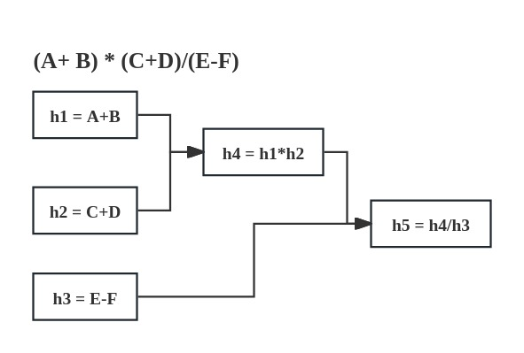

<div align="center">
<h1 align="center">Chyohn Terse Project</h1>


English | [简体中文](../../README.MD)


</div>
# Chyohn Terse Project

Chyohn Terse is a high-performance, Java-based open-source parallel framework.


## Getting Started

### Maven
```xml
<properties>
    <mask.version>1.0.0-SNAPSHOT</mask.version>
</properties>

<dependencies>
    <dependency>
        <groupId>io.github.chyohn.terse</groupId>
        <artifactId>terse</artifactId>
        <version>${terse.version}</version>
    </dependency>
</dependencies>
```

### Usage



#### Code Example with Thread Pool
```java
// Implement Context
class FlowContext implements IFlowContext {
    // .....
}

// define flow task and execute
TerseFlow<FlowContext> flow = Terse.<FlowContext>flow()
    // h1
    .callable("", context -> context.getA() + context.getB(), (context, v) -> context.setH1(v))
    // h2
    .callable("", context -> context.getC() + context.getD(), (context, v) -> context.setH2(v))
    .then() // then go h4 task
    // h4
    .callable("", context -> context.getH1() * context.getH2(), (context, v) -> context.setH4(v))
    .then() // then go h5 task
    // rely On h3 task
    .relyOn(Terse.<FlowContext>flow().callable("", context -> context.getE() - context.getF(), (context, v) -> context.setH3(v)))
    // h5
    .callable("", (context) -> context.getH4() / context.getH3(), (context, v) -> context.setH5(v))
    // build flow
    .build(context -> {
        // summary result
        System.out.printf("(%s+%s)*(%s+%s)/(%s-%s) = %s", context.getA(), context.getB(),
                    context.getC(), context.getD(), context.getE(), context.getF(), context.getH5());
    });

// generate context and params data
FlowContext context = new FlowContext(summary);
context.setA(1);context.setB(2);
context.setC(3);context.setD(4);
context.setE(5);context.setF(6);

// execute flow
flow.execute(context);
```

#### output
```text
(1+2)*(3+4)/(5-6) = -21
```

## License

Chyohn Terse software is licensed under the Apache License Version 2.0. See the [LICENSE](https://github.com/chyohn/terse/blob/master/LICENSE) file for details.