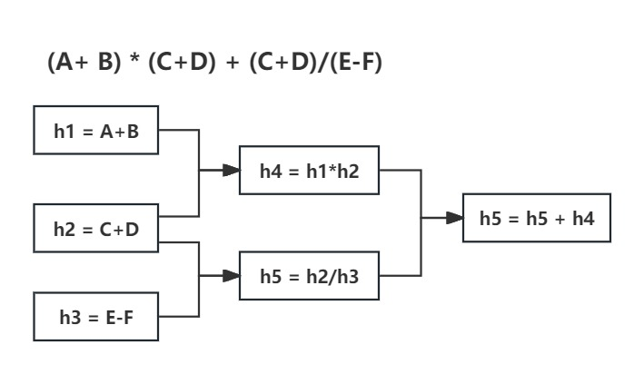

# 案例2：流程合并——面向流程设计

## 案例
以算术表达: (A+B)*(C+D)+(C+D)/(E-F)为列，DAG流程图如下，为了简单表达，我们的数字都是整型。

[//]: # (![flow2.jpg]&#40;https://s21.ax1x.com/2024/05/19/pku7FUJ.jpg&#41;)


### 实现方案

这篇案例我们复用[案例1：异步任务命令的使用——面向流程设计](./example_flow-oriented_command_zh.md)的代码，从而只需要单独定义流程即可，实现方案如下：
1. 独立定义h2流程，因为整个流程中有两个子流程（h4和h5）依赖h2；
2. 分别定义h4流程和h5流程，然后合并h4和h5。
3. h2与h1和h3互不依赖，因此h1和h3分别与h2合并；

### 代码实现


1. 独立定义h2流程
```java
TerseFlowBuilder<FlowContext> h2 = Terse.<FlowContext>flow()
        // h2
        .runCommand(context -> new CalculateCommand(context.getC(), Op.ADD, context.getD())
                , (context, v) -> context.setH2(v));
```

2. 定义h4流程
```java
TerseFlowBuilder<FlowContext> h4 = Terse.<FlowContext>flow()
        // h1
        .runCommand(context -> new CalculateCommand(context.getA(), Op.ADD, context.getB())
                , (context, v) -> context.setH1(v))
        // 合并h2
        .merge(h2)
        .then() // then go h4 task
        // h4
        .runCommand(context -> new CalculateCommand(context.getH1(), Op.MULTIPLY, context.getH2())
                , (context, v) -> context.setH4(v));
```

3. 定义h5流程
```java
TerseFlowBuilder<FlowContext> h5 =Terse.<FlowContext>flow()
        // h3
        .runCommand(context -> new CalculateCommand(context.getE(), Op.SUBTRACT, context.getF())
                , (context, v) -> context.setH3(v))
        // 合并h2
        .merge(h2)
        .then()
        // h5
        .runCommand((context) -> new CalculateCommand(context.getH2(), Op.DIVIDE, context.getH3())
                , (context, v) -> context.setH5(v));
```

4. 合并h4和h5流程
```java
TerseFlow<FlowContext> flow = Terse.<FlowContext>flow()
        .merge(h4)
        .merge(h5)
        .then()
        .runCommand(context -> new CalculateCommand(context.getH4(), Op.ADD, context.getH5())
                , (context, v) -> context.setH5(v))
        // build flow
        .build(context -> {
            // summary result
            System.out.printf("(%s+%s)*(%s+%s)+(%s+%s)/(%s-%s) = %s \n", context.getA(), context.getB(),
                    context.getC(), context.getD(),
                    context.getC(), context.getD(),  context.getE(), context.getF(),
                    context.getH5());
        });
```

5. 执行流程, 示例如下
```java
// generate context and params data
FlowContext context = new FlowContext();
context.setA(1);
context.setB(2);
context.setC(3);
context.setD(4);
context.setE(5);
context.setF(6);

// 执行流程并等待结果
flow.execute(context);
System.out.printf("执行结果：%s \n", context.getH5());
```