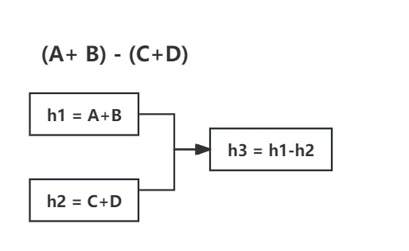

# 与Spring和Spring boot集成


## 第一步：maven引入

与spring的集成分两种，
1. 一种是普通的spring项目：需引入terse-spring模块，并配置ReceiverFactorySpringLoader bean。
2. 另一种是spring boot项目：只需引入terse-spring-boot-starter模块，不需要其他额外配置。

无论哪种集成方式，后面步骤都是一样的，在本步骤中，分别介绍下这两种集成方式。

### 1. 与普通spring项目集成
1. maven引入
```xml
 <dependency>
     <groupId>io.github.chyohn.terse</groupId>
     <artifactId>terse-spring</artifactId>
     <version>${terse.version}</version>
 </dependency>
```

2. 定义ReceiverFactorySpringLoader bean
   ReceiverFactorySpringLoader用于动态加载由Spring容器管理的IReceiverFactory实现类对象，可以通过xml定义或者@Configuration定义。

    - 方式1： xml定义
    ```xml
    <bean id="receiverFactorySpringLoader" factory-method="getReceiverFactorySpringLoader" class="io.github.chyohn.terse.spring.TerseSpringFactory" />
    ```

    - 方式2：@Configuration定义
    ```java
    @Configuration
    public class TerseSpringConfig {
        @Bean
        public ReceiverFactorySpringLoader receiverFactorySpringLoader() {
            return TerseSpringFactory.getReceiverFactorySpringLoader();
        }
    }
    ```

### 2. 与spring boot项目集成
maven引入
```xml
<dependency>
  <groupId>io.github.chyohn.terse</groupId>
  <artifactId>terse-spring-boot-starter</artifactId>
  <version>${terse.version}</version>
</dependency>
```
与spring boot集成，只需要maven引入即可，不需要其他配置。


## 第二步：定义IReceiverFactory实现类
引入terse的spring或spring boot支持后，所有的类都可以通过Spring容器管理，包括IReceiverFactory实现类、ITask实现类对象。

下面我们还是以计算器为例，定义一个IReceiverFactory实现类。并且通过Spring的@Component注解将其交给Spring容器管理。
```java
@Component
public class CalculateReceiverFactory implements IReceiverFactory<CalculateCommand> {
    @Override
    public void buildReceiver(IReceiverBuilder<CalculateCommand> builder) {
        builder.onReceive(CalculateCommand.class, command -> {
                    switch (command.getOp()) {
                        case ADD:
                            return command.getX() + command.getY();
                        case SUBTRACT:
                            return command.getX() - command.getY();
                        case MULTIPLY:
                            return command.getX() * command.getY();
                        case DIVIDE:
                            return command.getX() / command.getY();
                        default:
                            throw new IllegalArgumentException("不支持的操作");
                    }
                })
                // 这里设置线程池执行来执行上面命令
                .defaultExecutor(ForkJoinPool.commonPool());
    }
}
```
后面我们就可以在流程中使用CalculateCommand命令发起计算请求了。

## 第三步：构建流程
以计算(a+b)-(c+d)的值为例, DAG流程图如下，分别介绍面向流程和面向任务两种设计方式的使用，我们省略部分代码

[//]: # (![flow3.jpg]&#40;https://s21.ax1x.com/2024/05/19/pku7CbF.jpg&#41;)


### 1. 面向流程设计计算流程

1. 定义流程
```java
TerseFlow<FlowContext> flow = Terse.<FlowContext>flow()
    .runCommand(context -> new CalculateCommand(context.getA(), Op.ADD, context.getB()), (context, v) -> context.setH1(v))
    .runCommand(context -> new CalculateCommand(context.getC(), Op.ADD, context.getD()), (context, v) -> context.setH2(v))
    .then()
    .runCommand(context -> new CalculateCommand(context.getH1(), Op.SUBTRACT, context.getH2()), (context, v) -> context.setH3(v))
    .build();
```

2. 执行流程
```java
FlowContext context = new FlowContext();
context.setA(1);
context.setB(2);
context.setC(3);
context.setD(4);
flow.execute(context);
System.out.printf("(%s+%s)-(%s+%s) = %s \n", context.getA(), context.getB(), context.getC(), context.getD(), context.getH3());
```


### 2. 面向任务设计计算流程
需要定义的任务有：
- H1任务：计算a+b
- H2任务：计算c+d
- H3任务：依赖H1和H2任务，这2个任务完成后计算H1-H2
- summary任务：只需要依赖流程最后的节点H3
- 最后定义个service服务接收context参数来执行流程

每个任务都是一个Spring Bean，下面使用Spring提供的注解来往Spring容器注册bean，并通过@Autowired注入依赖的任务。示例代码如下：

1. 定义H1任务
```java
@Component
class H1Task implements ITaskSingle<FlowContext, Integer> {
    @Override
    public List<ITask<FlowContext>> relyOnTasks() {
        return null;
    }
    @Override
    public ICommandX<Integer> getCommand(FlowContext context) {
        return new CalculateCommand(context.getA(), Op.ADD, context.getB());
    }
    @Override
    public void handleResult(FlowContext context, Integer result) {
        context.setH1(result);
    }
}
```
2. 定义H2任务
```java
@Component
class H2Task implements ITaskSingle<FlowContext, Integer> {
    @Override
    public List<ITask<FlowContext>> relyOnTasks() {
        return null;
    }
    @Override
    public ICommandX<Integer> getCommand(FlowContext context) {
        return new CalculateCommand(context.getC(), Op.ADD, context.getD());
    }
    @Override
    public void handleResult(FlowContext context, Integer result) {
        context.setH2(result);
    }
}
```
3. 定义H3任务
```java
@Component
class H3Task implements ITaskSingle<FlowContext, Integer> {
    @Autowired
    H1Task h1Task;
    @Autowired
    H2Task h2Task;
    @Override
    public List<ITask<FlowContext>> relyOnTasks() {
        List<ITask<FlowContext>> relyOnTasks = new ArrayList<>();
        relyOnTasks.add(h1Task);
        relyOnTasks.add(h2Task);
        return relyOnTasks;
    }
    @Override
    public ICommandX<Integer> getCommand(FlowContext context) {
        return new CalculateCommand(context.getH1(), Op.SUBTRACT, context.getH2());
    }
    @Override
    public void handleResult(FlowContext context, Integer result) {
        context.setH3(result);
    }
}
```
4. 定义summary任务
```java
@Component
class Summary implements ISummaryTask<FlowContext> {
    @Autowired
    H3Task h3Task;
    @Override
    public List<ITask<FlowContext>> relyOnTasks() {
        List<ITask<FlowContext>> relyOnTasks = new ArrayList<>();
        relyOnTasks.add(h3Task);
        return relyOnTasks;
    }
    @Override
    public void summary(FlowContext context) {
        System.out.println("流程执行结束");
    }
}
```

5. 定义service服务
```java
@Service
class FlowService {
    @Autowired
    private Summary summary;
    public void execute(FlowContext context) {
        Terse.execute(summary, context);
    }
}
```

6. 执行流程
   现在就只需要在需要执行流程的地方调用FlowService的execute方法即可。
```java
FlowContext context = new FlowContext();
context.setA(1);
context.setB(2);
context.setC(3);
context.setD(4);
flowService.execute(context);
System.out.printf("(%s+%s)-(%s+%s) = %s \n", context.getA(), context.getB(), context.getC(), context.getD(), context.getH3());
```

## 总结
1. 通过Spring集成，不用显示往Terse中注册IReceiverFactory实现类对象，只需要将其交给Spring容器管理即可。
2. 面向任务设计中，任务类都交给Spring容器管理，通过@Autowired注入依赖的任务。
3. 面向流程设计更加简洁直观，引入spring中也无需做任何修改，不过适合简单的流程。
4. 面向任务设计更加灵活，不过引入spring后需要把任务对象交由spring管理。